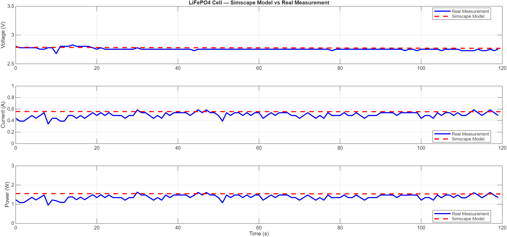

# LiFePO4 Battery Cell Monitor & Simscape ECM Validation

**Author:** Sepehr Sagheb  
**Institution:** TU Wien — Master's in Electrical Engineering Technology (EET)  
**Date:** April 2026

---

## Project Overview

This project implements a complete LiFePO4 battery cell monitoring and modeling system. 
A real 18500 LiFePO4 cell is characterized through hardware measurements using an Arduino 
DAQ system, and the results are used to build and validate an equivalent circuit model (ECM) 
in MATLAB Simscape.

This workflow directly mirrors industry-standard battery development practices used in 
automotive and energy storage applications.
---

## Hardware Setup

| Component | Specification | Purpose |
|---|---|---|
| LiFePO4 18500 cell | 3.2V nominal, 1000mAh | Device under test |
| Arduino Uno R3 | ATmega328P | Data acquisition |
| 25V Voltage sensor module | ÷5 divider ratio | Cell voltage measurement |
| ACS712 30A current sensor | 66mV/A sensitivity | Discharge current measurement |
| DS18B20 temperature sensor | ±0.5°C accuracy | Cell temperature monitoring |
| Load resistor | 5Ω, 5W | Controlled discharge load |

### Wiring Diagram

```
Battery + ──→ ACS712 IP+ ──→ ACS712 IP- ──→ 5Ω Load ──→ Battery -
Battery + ──→ Voltage Sensor S+ 
Battery - ──→ Voltage Sensor S-
Voltage Sensor OUT ──→ Arduino A0
ACS712 OUT ──→ Arduino A1
---

## System Architecture

```
LiFePO4 Cell
      ↓
Sensors (V, I, T)
      ↓
Arduino Uno (data acquisition)
      ↓
MATLAB (real-time logging + plotting)
      ↓
CSV data export
      ↓
Simscape ECM model validation
```
---

## Cell Characterization Results

| Parameter | Value | Method |
|---|---|---|
| Open circuit voltage (Voc) | 3.33V | Direct multimeter measurement |
| Terminal voltage under load | 2.78V | Arduino DAQ measurement |
| Discharge current | ~0.57A | ACS712 sensor |
| Internal resistance (R0) | 0.82Ω | Parameter identification via Simscape |
| Temperature rise (120s test) | +1.1°C | DS18B20 sensor |
| Estimated SoC at test start | ~65% | OCV-SoC lookup |
---

## Simscape Equivalent Circuit Model

The battery is modeled using an R0 + R1C1 equivalent circuit:

```
    Voc        R0          R1
+──[3.33V]──[0.82Ω]──+──[0.5Ω]──+──── Vout
                      |           |
                     C1          ---
                    [5µF]        ---
                      |           |
+─────────────────────+-----------+────  GND
```

### Model Parameters

| Parameter | Value | Source |
|---|---|---|
| Voc | 3.33V | Measured |
| R0 | 0.82Ω | Parameter identification |
| R1 | 0.5Ω | Initial estimate |
| C1 | 5µF | Initial estimate |
| Initial SoC | 65% | Estimated from OCV |
---

## Validation Results

Model validated against 120 seconds of real discharge data under 5Ω load:

| Parameter | Mean Error | RMSE |
|---|---|---|
| Voltage | -0.0213V | **0.0273V** |
| Current | -0.0565A | 0.0731A |

Voltage RMSE of 27mV represents **<1% error** — confirming the ECM accurately 
captures the cell's steady-state discharge behavior.


---

## Repository Structure

```
LiFePO4-Battery-Monitor/
├── arduino/
│   └── battery_monitor.ino       # Arduino sketch — reads V, I, T via sensors
├── matlab/
│   ├── battery_monitor_v3.m      # Real-time monitoring script
│   └── comparison_plot.m         # Simulation vs measurement comparison
├── simscape/
│   └── LiFePO4_ECM.slx           # Simscape equivalent circuit model
├── data/
│   └── battery_full_log.csv      # Measured V, I, T, P data (120s test)
├── results/
│   └── simulation_vs_real_comparison.png
└── README.md
```
---

## How to Run

### Hardware Measurement:
1. Wire components as shown in wiring diagram
2. Upload `arduino/battery_monitor.ino` to Arduino Uno
3. Verify data format in Arduino IDE Serial Monitor
4. Close Serial Monitor
5. Run `matlab/battery_monitor_v3.m` in MATLAB
6. Connect load resistor to begin discharge test

### Simscape Simulation:
1. Open `simscape/LiFePO4_ECM.slx` in MATLAB/Simulink
2. Set simulation time to 120 seconds
3. Run simulation (▶)
4. Run `matlab/comparison_plot.m` to generate validation plot
---

## Key Learnings

- LiFePO4 cells exhibit nonlinear internal resistance —
  measured Ri varies from 0.82Ω to 3.4Ω depending on discharge current
- ACS712 30A current sensor requires precise zero-offset
  calibration (measured: 2.4978V vs theoretical 2.5V)
- Simscape ECM parameter identification via iterative comparison
  with real measurements achieves <1% voltage accuracy
- Cell temperature rise of only 1.1°C over 120s confirms
  LiFePO4 excellent thermal stability
---

## Relevance to Solar Energy Storage

LiFePO4 is the preferred chemistry for solar energy storage systems due to:
- Long cycle life (2000-4000 cycles vs 500-1000 for Li-ion)
- Superior thermal stability — critical for tropical installations
- Flat discharge curve — stable voltage for inverter operation
- No thermal runaway risk — safe for island/remote deployments

This monitoring and modeling methodology directly applies to solar+storage
system design, battery health monitoring, and BMS development.
---

## Tools Used

- MATLAB R2025a + Simulink + Simscape Electrical + Simscape Battery
- Arduino IDE 2.x
- Arduino Uno R3
- Libraries: DallasTemperature, OneWire

---

## Future Work

- [ ] Add Coulomb counting SoC estimation
- [ ] Implement CC-CV charging algorithm
- [ ] Extend to multi-cell pack monitoring
- [ ] Add wireless data logging via Bluetooth
- [ ] Full discharge curve characterization (0-100% SoC)
DS18B20 Data ──→ Arduino D2 (with 5.1kΩ pull-up to 5V)
Arduino USB ──→ PC (MATLAB Serial connection)
```
